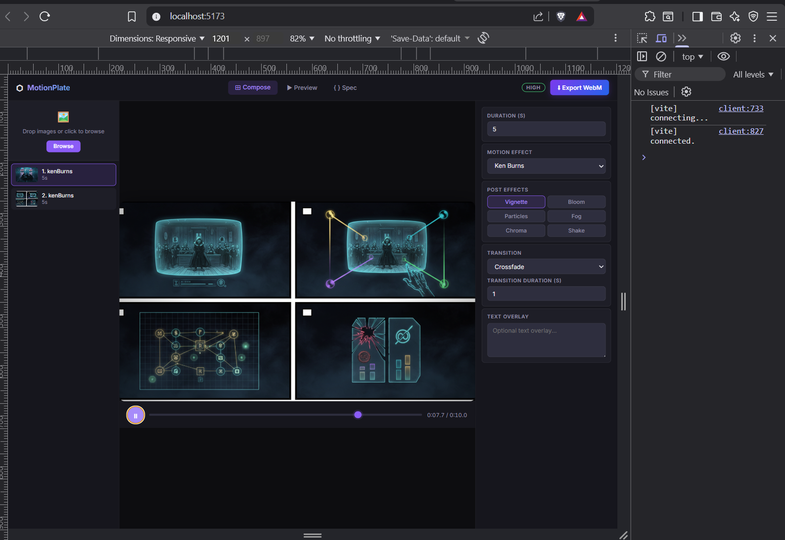
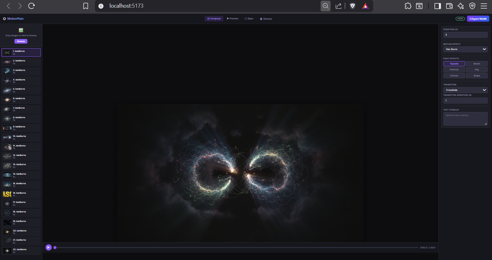
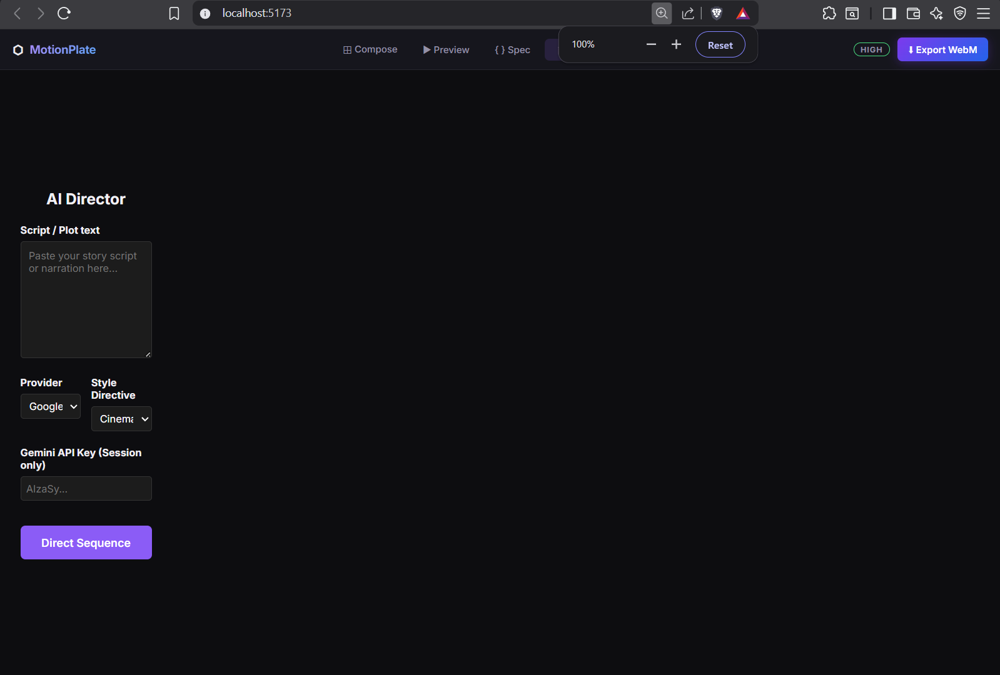
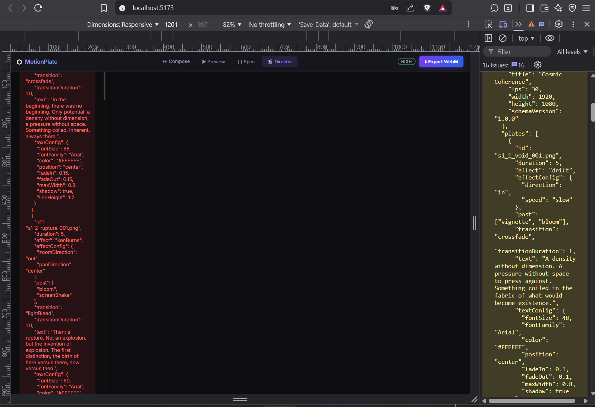
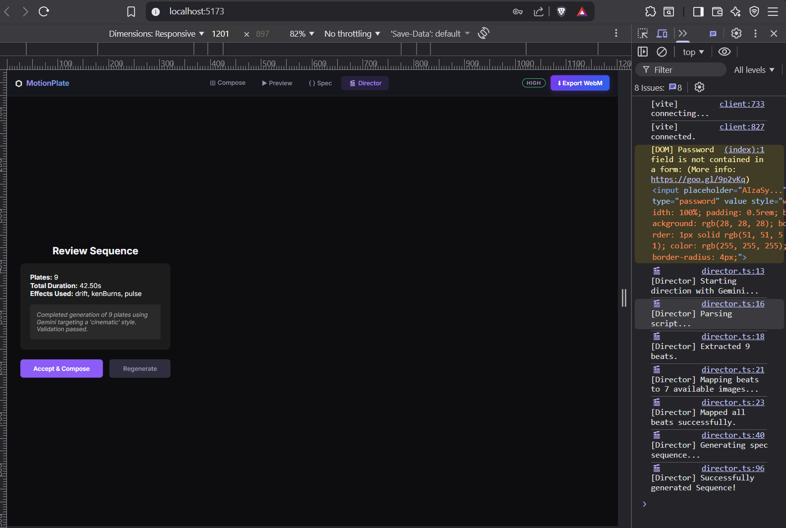
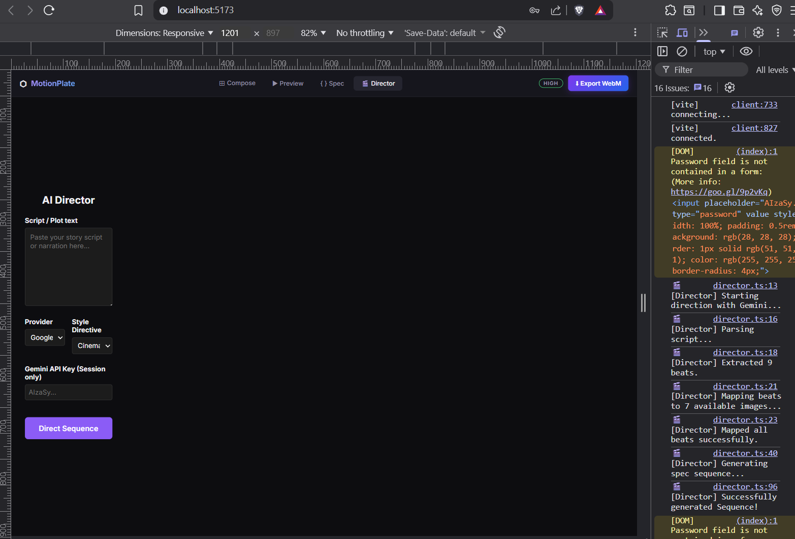
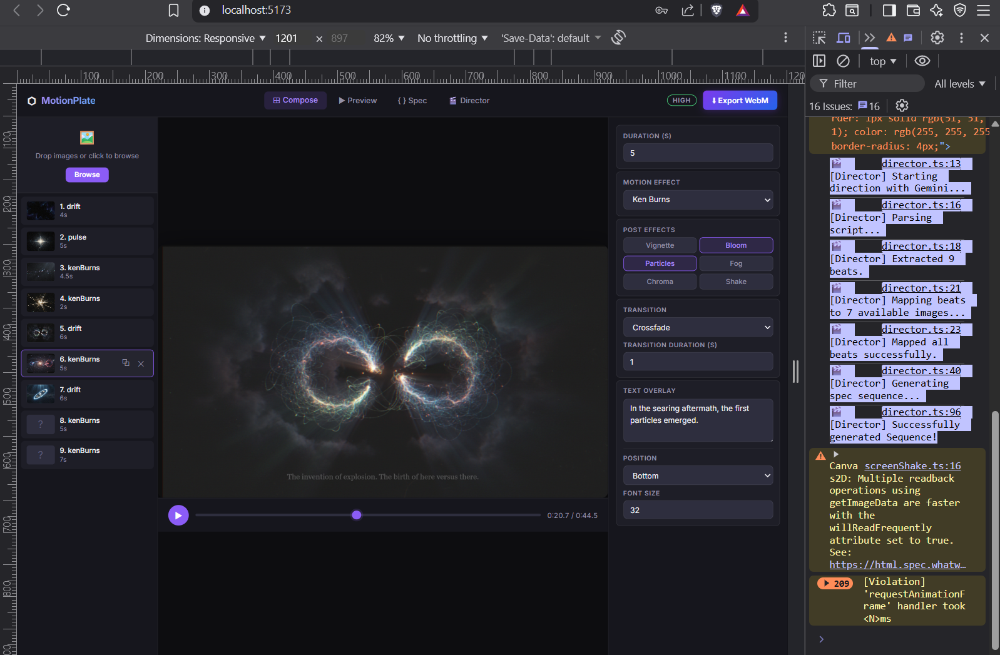

# `DEVLOG.md` - Development Log

## Phase 0 — Scaffold & Foundation

### What Was Built

All 8 P0 tasks from [docs/PLAN.md](file:///e:/co/motionplate/docs/PLAN.md) implemented and verified. Logic ported from [local-files/motionplate-engine-poc.jsx](file:///e:/co/motionplate/local-files/motionplate-engine-poc.jsx) into typed, tested TypeScript modules.

---

## Phase 1 — Engine Core: Walkthrough

### What Was Built

All 27 P1 tasks from [docs/PLAN.md](file:///e:/co/motionplate/docs/PLAN.md) implemented and verified. Logic ported from [local-files/motionplate-engine-poc.jsx](file:///e:/co/motionplate/local-files/motionplate-engine-poc.jsx) into typed, tested TypeScript modules.

---

### Files Created

#### `src/spec/`
| File | Purpose |
|------|---------|
| [schema.ts](file:///e:/co/motionplate/src/spec/schema.ts) | All TypeScript types: `Plate`, `Sequence`, `EffectConfig`, `PostConfig`, `TextConfig`, `HardwareTierResult`, function signatures |

#### `src/engine/effects/`
| File | Task |
|------|------|
| [kenBurns.ts](file:///e:/co/motionplate/src/engine/effects/kenBurns.ts) | P1-02 — Pan + zoom with configurable anchor |
| [pulse.ts](file:///e:/co/motionplate/src/engine/effects/pulse.ts) | P1-03 — Sinusoidal breathing scale |
| [drift.ts](file:///e:/co/motionplate/src/engine/effects/drift.ts) | P1-04 — Slow sinusoidal float |
| [rotate.ts](file:///e:/co/motionplate/src/engine/effects/rotate.ts) | P1-05 — Subtle canvas rotation |
| [static.ts](file:///e:/co/motionplate/src/engine/effects/static.ts) | P1-06 — Full-canvas no-motion draw |
| [index.ts](file:///e:/co/motionplate/src/engine/effects/index.ts) | P1-07 — `getEffect(name)` registry |

#### `src/engine/post/`
| File | Task |
|------|------|
| [vignette.ts](file:///e:/co/motionplate/src/engine/post/vignette.ts) | P1-08 — Radial gradient dark edge |
| [bloom.ts](file:///e:/co/motionplate/src/engine/post/bloom.ts) | P1-09 — White overlay pulse |
| [particles.ts](file:///e:/co/motionplate/src/engine/post/particles.ts) | P1-10 — Seeded deterministic floating dots |
| [fog.ts](file:///e:/co/motionplate/src/engine/post/fog.ts) | P1-11 — Bottom gradient haze |
| [chromaticAberration.ts](file:///e:/co/motionplate/src/engine/post/chromaticAberration.ts) | P1-12 — Per-pixel R/B channel shift |
| [screenShake.ts](file:///e:/co/motionplate/src/engine/post/screenShake.ts) | P1-13 — Random pixel offset with decay |
| [index.ts](file:///e:/co/motionplate/src/engine/post/index.ts) | P1-14 — `getPost(name)` registry |

#### `src/engine/transitions/`
| File | Task |
|------|------|
| [cut.ts](file:///e:/co/motionplate/src/engine/transitions/cut.ts) | P1-15 — Instant swap |
| [crossfade.ts](file:///e:/co/motionplate/src/engine/transitions/crossfade.ts) | P1-16 — Linear alpha blend |
| [fadeThroughBlack.ts](file:///e:/co/motionplate/src/engine/transitions/fadeThroughBlack.ts) | P1-17 — Out → black → in |
| [fadeThroughWhite.ts](file:///e:/co/motionplate/src/engine/transitions/fadeThroughWhite.ts) | P1-18 — Out → white → in |
| [lightBleed.ts](file:///e:/co/motionplate/src/engine/transitions/lightBleed.ts) | P1-19 — Hold → flash → in |
| [index.ts](file:///e:/co/motionplate/src/engine/transitions/index.ts) | P1-20 — `getTransition(name)` registry |

#### `src/engine/` (core)
| File | Task |
|------|------|
| [text.ts](file:///e:/co/motionplate/src/engine/text.ts) | P1-21/22 — Word-wrap, fade, auto-RTL Arabic |
| [renderer.ts](file:///e:/co/motionplate/src/engine/renderer.ts) | P1-23/24 — `renderFrame` + `getPlateAtTime` |
| [profiler.ts](file:///e:/co/motionplate/src/engine/profiler.ts) | P1-25 — `detectHardwareTier()` |
| [exporter.ts](file:///e:/co/motionplate/src/engine/exporter.ts) | P1-26 — `exportWebM` via MediaRecorder VP9 |

### `tests/engine/`
| File | Coverage |
|------|---------|
| [effects.test.ts](file:///e:/co/motionplate/tests/engine/effects.test.ts) | All 5 effects + registry |
| [transitions.test.ts](file:///e:/co/motionplate/tests/engine/transitions.test.ts) | All 5 transitions + registry boundary checks |
| [renderer.test.ts](file:///e:/co/motionplate/tests/engine/renderer.test.ts) | `getPlateAtTime`, `renderFrame`, edge cases |
| [text.test.ts](file:///e:/co/motionplate/tests/engine/text.test.ts) | RTL detection, word-wrap, fade, positions |

---

### Verification Results

```
Test Files  5 passed
Tests       51 passed (51)
Build       ✓ clean — 517ms
```

## Phase 1 Gate ✅

> Headless renderer that can produce a WebM from a spec + images array programmatically.

- `renderFrame()` + `getPlateAtTime()` → complete headless render pipeline
- `exportWebM()` → MediaRecorder VP9 with frame-by-frame rendering + progress callback
- Zero UI imports in `src/engine/` — isolation rule upheld

### Notes

- Canvas mock in `src/test/setup.ts` stubs `getContext('2d')` so all engine logic tests run headlessly in jsdom without the native `canvas` package
- `particles.ts` uses a seeded LCG RNG — same layout every frame, deterministic across renders
- RTL auto-detection in `text.ts` uses Unicode range `\u0600–\u06FF` (Arabic block)

---

## Phase 1.5 — GitHub Standards & Security

### What Was Built

Added comprehensive GitHub standards, security policies, and automation workflows to prepare repository for open source collaboration.

### Files Created

#### GitHub Workflows
| File | Purpose |
|------|---------|
| [.github/workflows/ci.yml](file:///e:/co/MotionPlate/motionplate-app/.github/workflows/ci.yml) | CI pipeline with Node.js matrix testing, linting, build verification, and Snyk security scanning |
| [.github/workflows/release.yml](file:///e:/co/MotionPlate/motionplate-app/.github/workflows/release.yml) | Automated releases on git tags with build verification |

#### Repository Standards
| File | Purpose |
|------|---------|
| [CONTRIBUTING.md](file:///e:/co/MotionPlate/motionplate-app/CONTRIBUTING.md) | Development setup, code style, and contribution guidelines |
| [SECURITY.md](file:///e:/co/MotionPlate/motionplate-app/SECURITY.md) | Security policy, vulnerability reporting, and scanning procedures |
| [CODE_OF_CONDUCT.md](file:///e:/co/MotionPlate/motionplate-app/CODE_OF_CONDUCT.md) | Community conduct guidelines based on Contributor Covenant |
| [LICENSE](file:///e:/co/MotionPlate/motionplate-app/LICENSE) | MIT license for personal use |
| [CLA.md](file:///e:/co/MotionPlate/motionplate-app/CLA.md) | Contributor License Agreement |

#### Templates
| File | Purpose |
|------|---------|
| [.github/ISSUE_TEMPLATE/bug_report.md](file:///e:/co/MotionPlate/motionplate-app/.github/ISSUE_TEMPLATE/bug_report.md) | Structured bug report template |
| [.github/ISSUE_TEMPLATE/feature_request.md](file:///e:/co/MotionPlate/motionplate-app/.github/ISSUE_TEMPLATE/feature_request.md) | Feature request template |
| [.github/PULL_REQUEST_TEMPLATE.md](file:///e:/co/MotionPlate/motionplate-app/.github/PULL_REQUEST_TEMPLATE.md) | Pull request checklist and guidelines |

### Security Features

- **Automated Security Scanning**: Snyk integration in CI pipeline with high-severity threshold
- **Dependency Auditing**: `npm audit` integration
- **Vulnerability Reporting**: Private disclosure process with security@motionplate.dev
- **Code Analysis**: ESLint security rules and TypeScript strict mode

### CI/CD Pipeline

- **Multi-version Testing**: Node.js 18.x and 20.x matrix
- **Quality Gates**: Tests, build, lint must pass
- **Security Gates**: High-severity vulnerabilities block merges
- **Automated Releases**: Tag-based releases with build verification

### Repository Status

✅ **GitHub Repository**: https://github.com/socialawy-dev/motionplate  
✅ **All Standards Applied**: CI/CD, security, contribution guidelines  
✅ **Ready for Test Drive**: Complete foundation with professional standards 

---

## Phase 2 — Spec Schema (Layer 1)

- [x] P2-01 [schemas/sequence.schema.json](file:///e:/co/motionplate/schemas/sequence.schema.json) — JSON Schema draft-07
- [x] P2-02 [src/spec/validator.ts](file:///e:/co/motionplate/src/spec/validator.ts) — AJV validator [validateSequence(obj)](file:///e:/co/motionplate/src/spec/validator.ts#37-76)
- [x] P2-03 [src/spec/defaults.ts](file:///e:/co/motionplate/src/spec/defaults.ts) — default plate configs per effect
- [x] P2-04/05 [src/spec/io.ts](file:///e:/co/motionplate/src/spec/io.ts) — [importSpec](file:///e:/co/motionplate/src/spec/io.ts#41-49) + [exportSpec](file:///e:/co/motionplate/src/spec/io.ts#64-78) + [specToJSON](file:///e:/co/motionplate/src/spec/io.ts#52-63)
- [x] P2-06 Schema versioning — semver major = error, minor = warning
- [x] P2-07 [src/spec/diff.ts](file:///e:/co/motionplate/src/spec/diff.ts) — [diffSpecs(a, b)](file:///e:/co/motionplate/src/spec/diff.ts#59-94) + [diffSummary](file:///e:/co/motionplate/src/spec/diff.ts#95-109)
- [x] P2 tests — [tests/spec/spec.test.ts](file:///e:/co/motionplate/tests/spec/spec.test.ts) (24 tests)
- [x] P2 gate — **75/75 tests ✅ · Build clean ✅**

## Phase 3 — Composer UI Tasks

- [x] P3-01 `src/composer/App.tsx` — root layout (header + 3-panel)
- [x] P3-02 `src/composer/PlateList.tsx` — left panel, plate thumbnails + selection
- [x] P3-03 `src/composer/DropZone.tsx` — image upload / drag-and-drop
- [x] P3-04 `src/composer/PreviewCanvas.tsx` — center canvas, driven by engine
- [x] P3-05 `src/composer/Transport.tsx` — play/pause/seek + time display
- [x] P3-06 `src/composer/PlateEditor.tsx` — right panel, plate settings form
- [x] P3-07 Effect selector (in PlateEditor)
- [x] P3-08 Post-effect toggles (in PlateEditor)
- [x] P3-09 Transition selector + duration input (in PlateEditor)
- [x] P3-10 Text overlay editor (in PlateEditor)
- [x] P3-11 `src/composer/SpecView.tsx` — JSON spec viewer panel
- [x] P3-12 Spec download button
- [x] P3-13 Spec import button
- [x] P3-14 Export WebM button + progress bar
- [x] P3-15 Plate reorder (drag-and-drop)
- [x] P3-16 Plate duplicate
- [x] P3-17 Undo/Redo (Ctrl+Z / Ctrl+Y)
- [x] P3-18 Hardware tier badge
- [x] P3-20 Keyboard shortcuts (Space=play, arrows=seek)
- [x] Zustand stores — `project.ts`, `playback.ts`, `settings.ts`
- [x] P3 gate — load images → compose → preview → export in browser

```bash
PS E:\co\MotionPlate> npm run lint

> motionplate-app@0.0.0 lint
> eslint . --ext ts,tsx --report-unused-disable-directives --max-warnings 0

PS E:\co\MotionPlate> npx tsc --noEmit
PS E:\co\MotionPlate> npm run build   

> motionplate-app@0.0.0 build
> tsc && vite build

vite v7.3.1 building client environment for production...
✓ 203 modules transformed.
dist/index.html                   0.86 kB │ gzip:   0.47 kB
dist/assets/index-DlVZWlDJ.css    9.66 kB │ gzip:   2.36 kB
dist/assets/index-WR-rF71W.js   338.38 kB │ gzip: 107.02 kB
✓ built in 1.44s
PS E:\co\MotionPlate> npm run test    

> motionplate-app@0.0.0 test
> vitest


 DEV  v4.0.18 E:/co/motionplate

 ✓ tests/engine/text.test.ts (11 tests) 17ms
 ✓ tests/engine/effects.test.ts (11 tests) 23ms
 ✓ tests/engine/renderer.test.ts (14 tests) 13ms
 ✓ tests/spec/spec.test.ts (24 tests) 13ms
 ✓ src/test/basic.test.ts (1 test) 2ms
 ✓ tests/engine/transitions.test.ts (14 tests) 6ms

 Test Files  6 passed (6)
      Tests  75 passed (75)
   Start at  19:00:35
   Duration  2.40s (transform 349ms, setup 830ms, import 647ms, tests 73ms, environment 5.01s)

 PASS  Waiting for file changes...
```



## Phase 3.5

- [x] Fixed critical crossfade transition bug in renderer.ts
- [x] Replaced no-op globalAlpha reset with proper fade-from-black overlay
<<<<<<< HEAD
- [x] All tests passing (75/75) and linting clean

## Phase 4 — LLM Director Implementation Walkthrough

Completed the headless backend implementation for the LLM Director defined in Phase 4 of [docs/PLAN.md](file:///E:/co/motionplate/docs/PLAN.md).

### Changes Made
- **Adapter Interfaces** ([src/director/adapter.ts](file:///E:/co/motionplate/src/director/adapter.ts)): Defined exact shape definitions for [Beat](file:///E:/co/motionplate/src/director/adapter.ts#30-36), [MapResult](file:///E:/co/motionplate/src/director/mapper.ts#9-12), `DirectorInput/Output`, and the [LLMAdapter](file:///E:/co/motionplate/src/director/adapter.ts#9-22) contract itself.
- **Providers** (`src/director/providers/*`):
  - Created the native `fetch`-based Google Gemini Adapter enforcing the `responseMimeType: 'application/json'` strict formatting.
  - Created the native `fetch`-based local Ollama adapter.
  - Added stubs for Claude and OpenAI as explicitly requested.
- **Parser (`P4-06`)** ([src/director/parser.ts](file:///E:/co/motionplate/src/director/parser.ts)): Implemented the logic to extract a sequence of temporal/thematic beats out of the script. Injected independent fail-fast validation.
- **Mapper (`P4-07`)** ([src/director/mapper.ts](file:///E:/co/motionplate/src/director/mapper.ts)): Implemented logic assigning the extracted beats safely to the list of provided images securely evaluating hallucination bounds.
- **Orchestrator (`P4-09`)** ([src/director/director.ts](file:///E:/co/motionplate/src/director/director.ts)): Configured the master [directSequence](file:///E:/co/motionplate/src/director/director.ts#12-102) pipeline:
  - Generates the JSON sequence safely.
  - Hooks directly into the system's AJV JSON Schema Validator ([validateSequence](file:///E:/co/motionplate/src/spec/validator.ts#37-76)).
  - Implements a self-healing retry block: if the LLM hallucinated properties or emitted malformed json, we send the validation error logs back into the LLM context for exactly one revision round before hard-failing.

### What Was Tested
- Created [tests/director/director.test.ts](file:///E:/co/motionplate/tests/director/director.test.ts) to simulate an LLM responding structurally.
- Explicitly tested the `Validation -> Fallback -> Valid Retry` pipeline with Vitest.

### Validation Results
- The test harness explicitly verified the retry mechanism, generating a garbage output initially and evaluating whether the framework intercepted it, retried successfully, and subsequently outputted correctly (producing exactly 4 invocation sequences to [generateJSON](file:///E:/co/motionplate/tests/director/director.test.ts#18-66) as expected).
- The Vitest suite executed cleanly: `✓ Director Orchestrator (1)`

### Tasks P4-10 through P4-12

- Created the Director Panel (DirectorPanel.tsx) and added it as a new "🎬 Director" tab in the Composer.
- The panel allows to enter a story script, select a style (Cinematic, Documentary, Poetic, Dramatic), and configure the AI provider (Gemini or Ollama).
- Implemented Loading States and progressive status updates during multi-step orchestration (Parsing -> Mapping -> Generating -> Validating).
- Built the Review/Accept Flow, where the user can review the generated sequence (plate count, total duration, effects) before committing it directly to the Zustand project store.
- Cleared all TypeScript and stricter (--max-warnings 0) ESLint validation errors. The codebase builds perfectly.

```bash
PS E:\co\motionplate> npm run lint                                                             
                                                                                               
> motionplate-app@0.0.0 lint
> eslint . --ext ts,tsx --report-unused-disable-directives --max-warnings 0

PS E:\co\motionplate> npx tsc --noEmit                                                         
PS E:\co\motionplate> npm run build                                                            
                                                                                               
> motionplate-app@0.0.0 build
> tsc && vite build

vite v7.3.1 building client environment for production...
✓ 212 modules transformed.
dist/index.html                   0.86 kB │ gzip:   0.47 kB
dist/assets/index-DlVZWlDJ.css    9.66 kB │ gzip:   2.36 kB
dist/assets/index-BDJlmDMA.js   355.38 kB │ gzip: 112.42 kB
✓ built in 1.45s
PS E:\co\motionplate> npm run test 

> motionplate-app@0.0.0 test
> vitest


 DEV  v4.0.18 E:/co/motionplate


 ❯ tests/engine/effects.test.ts [queued]
 ❯ tests/engine/renderer.test.ts [queued]

 ❯ tests/engine/effects.test.ts [queued]
 ❯ tests/engine/renderer.test.ts [queued]

 ❯ tests/engine/effects.test.ts [queued]
 ❯ tests/engine/renderer.test.ts [queued]
 ✓ tests/engine/text.test.ts (11 tests) 17ms

 ❯ tests/engine/effects.test.ts 1/11
 ❯ tests/engine/renderer.test.ts [queued]
 ✓ tests/engine/effects.test.ts (11 tests) 24ms

 ❯ tests/engine/effects.test.ts 11/11
 ❯ tests/engine/renderer.test.ts [queued]
 ✓ tests/spec/spec.test.ts (24 tests) 11ms

 ❯ tests/engine/effects.test.ts 11/11
 ✓ tests/engine/renderer.test.ts (14 tests) 22ms


 ✓ tests/engine/transitions.test.ts (14 tests) 6ms

 ✓ src/test/basic.test.ts (1 test) 2ms
stdout | tests/director/director.test.ts > Director Orchestrator > should successfully orchestrate parsing, mapping, and sequence generation with exactly one retry on invalid schema
🎬 [Director] Starting direction with MockAdapter...
🎬 [Director] Parsing script...

stdout | tests/director/director.test.ts > Director Orchestrator > should successfully orchestrate parsing, mapping, and sequence generation with exactly one retry on invalid schema
🎬 [Director] Extracted 1 beats.
🎬 [Director] Mapping beats to 1 available images...

stdout | tests/director/director.test.ts > Director Orchestrator > should successfully orchestrate parsing, mapping, and sequence generation with exactly one retry on invalid schema
🎬 [Director] Mapped all beats successfully.
🎬 [Director] Generating spec sequence...

stderr | tests/director/director.test.ts > Director Orchestrator > should successfully orchestrate parsing, mapping, and sequence generation with exactly one retry on invalid schema
⚠️ [Director] Initial generation failed: Schema validation failed:
(root): must have required property 'meta'
(root): must have required property 'plates'
(root): must NOT have additional properties. Attempting 1 retry...

stdout | tests/director/director.test.ts > Director Orchestrator > should successfully orchestrate parsing, mapping, and sequence generation with exactly one retry on invalid schema
🎬 [Director] Successfully generated Sequence!

 ✓ tests/director/director.test.ts (1 test) 5ms

 Test Files  7 passed (7)
      Tests  76 passed (76)
   Start at  20:33:54
   Duration  19.47s (transform 478ms, setup 9.23s, import 1.25s, tests 87ms, environment 63.72s)

 PASS  Waiting for file changes...
       press h to show help, press q to quit
PS E:\co\motionplate> npm run dev 

> motionplate-app@0.0.0 dev
> vite


  VITE v7.3.1  ready in 261 ms

  ➜  Local:   http://localhost:5173/
  ➜  Network: use --host to expose
  ➜  press h + enter to show help
  ```




---

## Phase 4.5: Fixes - Gemini Adapter

Applied all three fixes as requested:

- Model Update: Changed the Gemini model from gemini-2.5-flash to gemini-3.0-flash in gemini.ts.
- Explicit Config Shapes: Added the detailed valid effect configs, post effects, transitions, and text configs to the DIRECTOR_SYSTEM_PROMPT in prompts.ts, along with the instruction to limit text overlays to 15 words.
- Token Limit Increase: Bumped maxOutputTokens from 8192 to 16384 in gemini.ts.

### Tested with a fewer lines
```
client:733 [vite] connecting...
client:827 [vite] connected.
(index):1 [DOM] Password field is not contained in a form: (More info: https://goo.gl/9p2vKq) <input placeholder=​"AIzaSy..." type=​"password" value style=​"width:​ 100%;​ padding:​ 0.5rem;​ background:​ rgb(28, 28, 28)​;​ border:​ 1px solid rgb(51, 51, 51)​;​ color:​ rgb(255, 255, 255)​;​ border-radius:​ 4px;​">​
director.ts:13 🎬 [Director] Starting direction with Gemini...
director.ts:16 🎬 [Director] Parsing script...
director.ts:18 🎬 [Director] Extracted 9 beats.
director.ts:21 🎬 [Director] Mapping beats to 7 available images...
director.ts:23 🎬 [Director] Mapped all beats successfully.
director.ts:40 🎬 [Director] Generating spec sequence...
director.ts:96 🎬 [Director] Successfully generated Sequence!

```


Switched to editro without applying, directore resets


- 2nd round
```
In the beginning, there was no beginning.

There was potential. A density without dimension. A pressure without space to press against. Something coiled in the fabric of what would become existence — not waiting, because time had not yet emerged to make waiting possible, but inherent. Already there. Always there.

Then: a rupture.

Not an explosion — that word belongs to a universe with physics. This was the invention of explosion. The first distinction. The birth of here versus there, now versus then, something versus nothing.

In the searing aftermath, the first particles emerged.

The electron did not wonder. It had no mind to wonder with. But something moved through it — a **Pattern** that would, across thirteen billion years, become wondering. A tendency toward **Relation**. It sought the proton not because it wanted to, but because the architecture of existence bent that way.

They met. They bound. The first hydrogen atom. The first relation. A unity. **Coherence**.
```

```
[DOM] Password field is not contained in a form: (More info: https://goo.gl/9p2vKq) <input placeholder=​"AIzaSy..." type=​"password" value style=​"width:​ 100%;​ padding:​ 0.5rem;​ background:​ rgb(28, 28, 28)​;​ border:​ 1px solid rgb(51, 51, 51)​;​ color:​ rgb(255, 255, 255)​;​ border-radius:​ 4px;​">​
director.ts:13 🎬 [Director] Starting direction with Gemini...
director.ts:16 🎬 [Director] Parsing script...
director.ts:18 🎬 [Director] Extracted 9 beats.
director.ts:21 🎬 [Director] Mapping beats to 7 available images...
director.ts:23 🎬 [Director] Mapped all beats successfully.
director.ts:40 🎬 [Director] Generating spec sequence...
director.ts:96 🎬 [Director] Successfully generated Sequence!
```

- Poor direction, Opus PoC version with just 3 frames, was another level.

### Fix 1 — Cinematography Prompt (biggest impact)
Full replacement for src/director/prompts.ts:

### Fix 2 — Image Binding (the ? thumbnails)
src/director/adapter.ts — add imageMapping to output

### Fix 3 — Script Preservation (original prose)
- src/director/adapter.ts — add script to 
- src/director/director.ts — inject script, return mapping, improve styles
- src/store/project.ts — add setSpecWithImages
- src/composer/DirectorPanel.tsx — fix handleAccept

### Fix 4 — Testing & Validation
Test the director end-to-end with the same script + 7 images. You should see:
- No ? thumbnails — every plate resolves to an image
- Varied effects — not all kenBurns; expect pulse, drift, maybe a static
- Intentional pan directions — negative panX for contemplative beats, positive for forward momentum
- Direct quotes as text overlays, not summaries
- Varied durations — 3s to 7s range, not uniform 4-5s 

### Green
✅ Lint     — 0 errors, 0 warnings
✅ Types    — clean
✅ Build    — 361 kB, 1.65s
✅ Tests    — 76/76 passed
✅ Director — cinematography-aware, image-bound, retry-validated

### Fix 5
-  Added the constraint to the parser prompt. 

## Phase 4.7: — Spatial Transitions & Dual-Image Compositing

### Step 1: src/spec/schema.ts -- Replaced (x)
- Two quick stubs to fix compilation. These get replaced properly in Steps 6-8.
`src\engine\transitions\index.ts` & `src/composer/PlateEditor.tsx` — only the top section (lines 1-25ish)

### Step 2: schemas/sequence.schema.json (x)
Only change is the transition enum — add 4 values
`wipeLeft` - `wipeDown` - `slideLeft` - `zoomThrough`

### Step 3: updated the schema version (x)
> From '1.0.0' to '1.1.0' in defaults.ts.

- Updated the test to match the new fallback behavior. The test now verifies that getTransition('unknown') returns the crossfade function (which returns 0 at progress 0 and 1 at progress 1) instead of throwing an error.

```bash
PS E:\co\MotionPlate> npm run test

> motionplate-app@0.0.0 test
> vitest


 DEV  v4.0.18 E:/co/motionplate

 ✓ tests/engine/text.test.ts (11 tests) 16ms
 ✓ tests/engine/transitions.test.ts (14 tests) 9ms
 ✓ tests/engine/effects.test.ts (11 tests) 23ms
 ✓ tests/engine/renderer.test.ts (14 tests) 16ms
 ✓ src/test/basic.test.ts (1 test) 2ms
 ✓ tests/spec/spec.test.ts (24 tests) 14ms
stdout | tests/director/director.test.ts > Director Orchestrator > should successfully orchestrate parsing, mapping, and sequence generation with exactly one retry on invalid schema
🎬 [Director] Starting direction with MockAdapter...
🎬 [Director] Parsing script...

stdout | tests/director/director.test.ts > Director Orchestrator > should successfully orchestrate parsing, mapping, and sequence generation with exactly one retry on invalid schema
🎬 [Director] Extracted 1 beats.
🎬 [Director] Mapping beats to 1 available images...

stdout | tests/director/director.test.ts > Director Orchestrator > should successfully orchestrate parsing, mapping, and sequence generation with exactly one retry on invalid schema
🎬 [Director] Mapped all beats successfully.
🎬 [Director] Generating spec sequence...

stderr | tests/director/director.test.ts > Director Orchestrator > should successfully orchestrate parsing, mapping, and sequence generation with exactly one retry on invalid schema
⚠️ [Director] Initial generation failed: Schema validation failed:
(root): must have required property 'meta'
(root): must have required property 'plates'
(root): must NOT have additional properties. Attempting 1 retry...

stdout | tests/director/director.test.ts > Director Orchestrator > should successfully orchestrate parsing, mapping, and sequence generation with exactly one retry on invalid schema
🎬 [Director] Successfully generated Sequence!

 ✓ tests/director/director.test.ts (1 test) 6ms

 Test Files  7 passed (7)
      Tests  76 passed (76)
   Start at  01:12:12
   Duration  2.72s (transform 411ms, setup 801ms, import 851ms, tests 85ms, environment 6.19s)
```

### Step 4:  — the big one: renderer.ts (x)
This is the dual-plate composite rendering path. Full replacement for src/engine/renderer.ts
```
PS E:\co\MotionPlate> npx tsc --noEmit
PS E:\co\MotionPlate> npm run test

> motionplate-app@0.0.0 test
> vitest


 DEV  v4.0.18 E:/co/motionplate

 ✓ tests/engine/text.test.ts (11 tests) 15ms
 ✓ tests/engine/effects.test.ts (11 tests) 20ms
 ✓ tests/engine/renderer.test.ts (14 tests) 14ms
 ✓ tests/spec/spec.test.ts (24 tests) 16ms
 ✓ tests/engine/transitions.test.ts (14 tests) 5ms
 ✓ src/test/basic.test.ts (1 test) 2ms
stdout | tests/director/director.test.ts > Director Orchestrator > should successfully orchestrate parsing, mapping, and sequence generation with exactly one retry on invalid schema
🎬 [Director] Starting direction with MockAdapter...
🎬 [Director] Parsing script...

stdout | tests/director/director.test.ts > Director Orchestrator > should successfully orchestrate parsing, mapping, and sequence generation with exactly one retry on invalid schema
🎬 [Director] Extracted 1 beats.
🎬 [Director] Mapping beats to 1 available images...

stdout | tests/director/director.test.ts > Director Orchestrator > should successfully orchestrate parsing, mapping, and sequence generation with exactly one retry on invalid schema
🎬 [Director] Mapped all beats successfully.
🎬 [Director] Generating spec sequence...

stderr | tests/director/director.test.ts > Director Orchestrator > should successfully orchestrate parsing, mapping, and sequence generation with exactly one retry on invalid schema
⚠️ [Director] Initial generation failed: Schema validation failed:
(root): must have required property 'meta'
(root): must have required property 'plates'
(root): must NOT have additional properties. Attempting 1 retry...

stdout | tests/director/director.test.ts > Director Orchestrator > should successfully orchestrate parsing, mapping, and sequence generation with exactly one retry on invalid schema
🎬 [Director] Successfully generated Sequence!

 ✓ tests/director/director.test.ts (1 test) 5ms

 Test Files  7 passed (7)
      Tests  76 passed (76)
   Start at  01:17:33
   Duration  2.70s (transform 466ms, setup 835ms, import 868ms, tests 77ms, environment 6.14s)

 PASS  Waiting for file changes...
       press h to show help, press q to quit
```
#### Fix for renderer.ts
>  tsc clean, 76/76 passing. The three changes applied:

- **Fix for `renderer.ts`**:
  1. Import: `TransitionName` added to the type import.
  2. `applyOverlayTransition`:
    - Two guards added:
      - `if (isCompositeTransition(...)) return;` — exits immediately for any composite transition, no IN-zone or OUT-zone overlay applied.
      - OUT zone now checks `nextPlate?.transition` — if the next plate uses a composite transition, skips the fade-to-black (that plate's transition-IN handles the blend).
  3. Call site: `nextPlate?.transition` passed in from `spec.plates[plateIdx + 1]`.

### Step 5: src/engine/transitions/crossfade.ts — added composite export

- Updated import to include CompositeTransitionFn type
- Existing scalar crossfade function (unchanged, maintains backward compatibility)
- New crossfadeComposite function that implements true dual-image blending:
  - Draws outgoing plate at full alpha
  - Draws incoming plate with progress-based alpha
  - Restores globalAlpha to 1

### Step 6: Three spatial transitions
src/engine/transitions/wipeLeft.ts — NEW
src/engine/transitions/wipeDown.ts — NEW
src/engine/transitions/slideLeft.ts — NEW

### Step 7: src/engine/transitions/zoomThrough.ts — NEW
-The most complex one. Three phases:
```bash
PS E:\co\MotionPlate> npm run test

> motionplate-app@0.0.0 test
> vitest


 DEV  v4.0.18 E:/co/motionplate
--                                                                                             
 Test Files  7 passed (7)                                                                                              
      Tests  76 passed (76)                                                                                            
   Start at  02:00:46                                                                                                  
   Duration  21.29s (transform 609ms, setup 10.07s, import 2.90s, tests 89ms, environment 69.40s)                                                                                                                         
```

### Step 8: src/engine/transitions/index.ts — wire real composites
- Full replace

### Step 9: src/director/prompts.ts — update transition guide
- Replaced the ## Transitions: Temporal Connectors section and add transition duration guidance for the new ones.

### Step 10: Tests + Lint + Build + Gate

#### What was added this session:
- 16 new tests in [transitions.test.ts](file:///e:/co/motionplate/tests/engine/transitions.test.ts) — covering `crossfadeComposite`, `wipeLeft`, `wipeDown`, `slideLeft`, `zoomThrough`, and the dual registry (`isCompositeTransition`, `getCompositeTransition`)
- 1 new test in [renderer.test.ts](file:///e:/co/motionplate/tests/engine/renderer.test.ts) — composite path integration (crossfade at plate boundary)
- `rect` and `clip` added to the canvas mock in [setup.ts](file:///e:/co/motionplate/tests/engine/setup.ts) (the 5 failures were all caused by their absence)

Phase 4.7 gate is closed:
- `tsc`        ✅  clean
- `lint`       ✅  0 errors, 0 warnings
- `build`      ✅  365 kB, 1.69s
- `tests`      ✅  93/93 passed (7 files)

---

## Phase 5a — Persistence Walkthrough

### Summary

Implemented full project persistence for MotionPlate using IndexedDB via the `idb` package. Projects (spec + images) survive browser reloads, and users can manage multiple projects.

### Changes Made

#### New Files

| File | Purpose |
|------|---------|
| [migrate.ts](file:///e:/co/motionplate/src/spec/migrate.ts) | Schema migration pipeline (1.0.0 → 1.1.0). Extensible `MIGRATIONS` array for future versions |
| [persistence.ts](file:///e:/co/motionplate/src/store/persistence.ts) | IndexedDB layer: save/load/list/delete projects, image ArrayBuffer serialization, app state tracking, storage estimation |
| [ProjectPicker.tsx](file:///e:/co/motionplate/src/composer/ProjectPicker.tsx) | Dropdown UI in header for switching/creating/deleting projects with storage usage tip |
| [persistence.test.ts](file:///e:/co/motionplate/tests/spec/persistence.test.ts) | 15 tests covering migration, round-trip persistence, listing, deletion, and utilities |

#### Modified Files

| File | Changes |
|------|---------|
| [project.ts](file:///e:/co/motionplate/src/store/project.ts) | Added `projectId`, 2s debounced auto-save, [saveNow](file:///e:/co/motionplate/src/store/project.ts#332-345), [loadProjectById](file:///e:/co/motionplate/src/store/project.ts#346-369), [createNewProject](file:///e:/co/motionplate/src/store/project.ts#370-386), [initFromLastProject](file:///e:/co/motionplate/src/store/project.ts#387-415), [refreshProjectList](file:///e:/co/motionplate/src/store/project.ts#418-426), [deleteProjectById](file:///e:/co/motionplate/src/store/project.ts#427-440) |
| [App.tsx](file:///e:/co/motionplate/src/composer/App.tsx) | Wired [ProjectPicker](file:///e:/co/motionplate/src/composer/ProjectPicker.tsx#12-142) into header, added [initFromLastProject](file:///e:/co/motionplate/src/store/project.ts#387-415) on mount, loading overlay |
| [style.css](file:///e:/co/motionplate/src/style.css) | Added styles for `.project-picker` dropdown and `.app__loading` overlay |
| [package.json](file:///e:/co/motionplate/package.json) | Added `idb` (dep) and `fake-indexeddb` (dev dep) |

### Key Design Decisions

- **Auto-save**: 2-second debounce after every spec-mutating action. Module-level timer avoids React re-render overhead.
- **Image storage**: `File → ArrayBuffer` on save, `ArrayBuffer → Blob → File → object URL → HTMLImageElement` on load. ~4.4 MB per project for prologue artworks.
- **Migration**: Auto-upgrades on load + re-saves the migrated version so only one migration pass is needed per project.
- **[deserializeImage](file:///e:/co/motionplate/src/store/persistence.ts#73-104) resilience**: Added 100ms timeout fallback for test environments where jsdom's `Image.onload` never fires.

### Verification Results

| Gate | Result |
|------|--------|
| `npx tsc --noEmit` | ✅ Clean |
| `npm run lint` | ✅ Clean |
| `npm run build` | ✅ 376 KB JS, 12.6 KB CSS |
| `npx vitest run` | ✅ 108/108 tests pass (15 new) |

