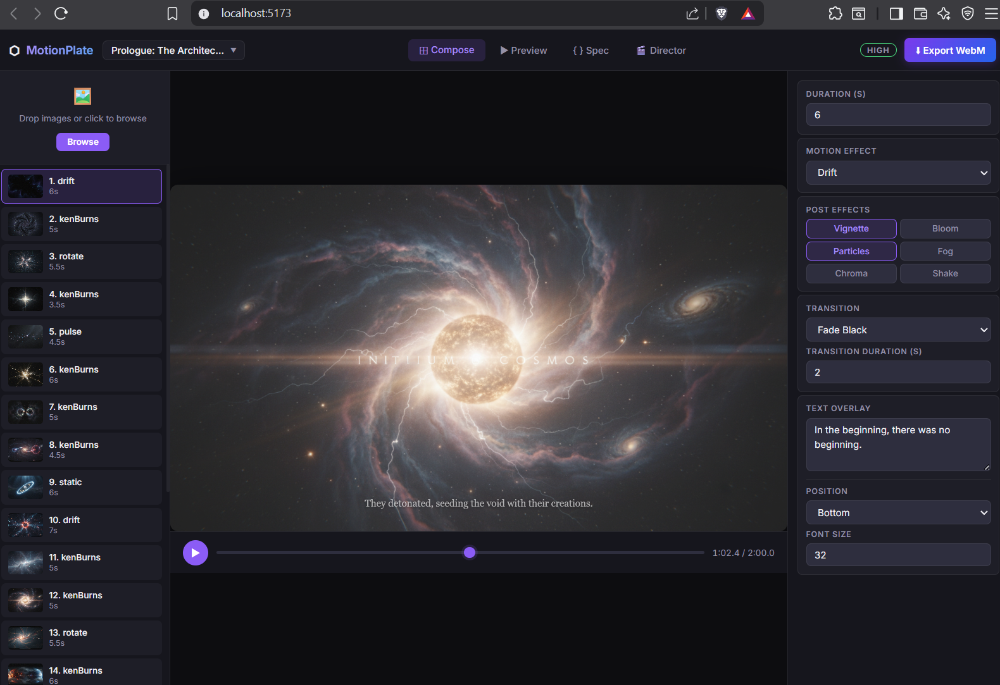
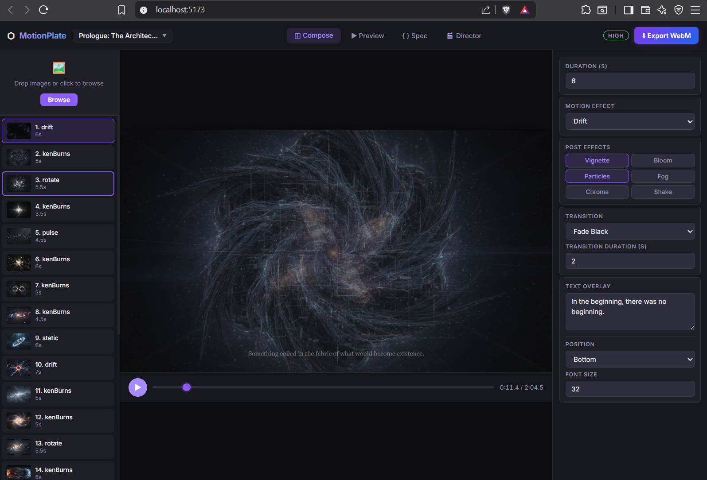

What it involves
You already have all the pieces:

The playback timer is already tracking currentTime
The frame list in the sidebar already knows each frame's start/end time
You just need to scroll-to and highlight the frame whose time range contains currentTime
Implementation (minimal)
It would be roughly:

Derive the active frame index from currentTime — just a simple loop or findIndex over the frames array comparing accumulated durations vs. current time.
Apply a CSS class (e.g., frame-active) to that sidebar item — a border glow or background highlight.
Auto-scroll the sidebar to keep the active frame visible — one scrollIntoView({ behavior: 'smooth', block: 'nearest' }) call.
Performance
Zero extra GPU/CPU cost — you're not rendering anything new, just toggling a CSS class on a DOM element that already exists.
The calculation runs once per animation frame tick (which you already have), and it's just comparing two numbers — negligible.
scrollIntoView is natively optimized by the browser.
Verdict
Aspect	Impact
Code complexity	~20-30 lines
CPU/GPU cost	Negligible
Visual payoff	High — makes the composer feel alive and professional
It's one of those features with a huge UX payoff for almost no cost.

--

