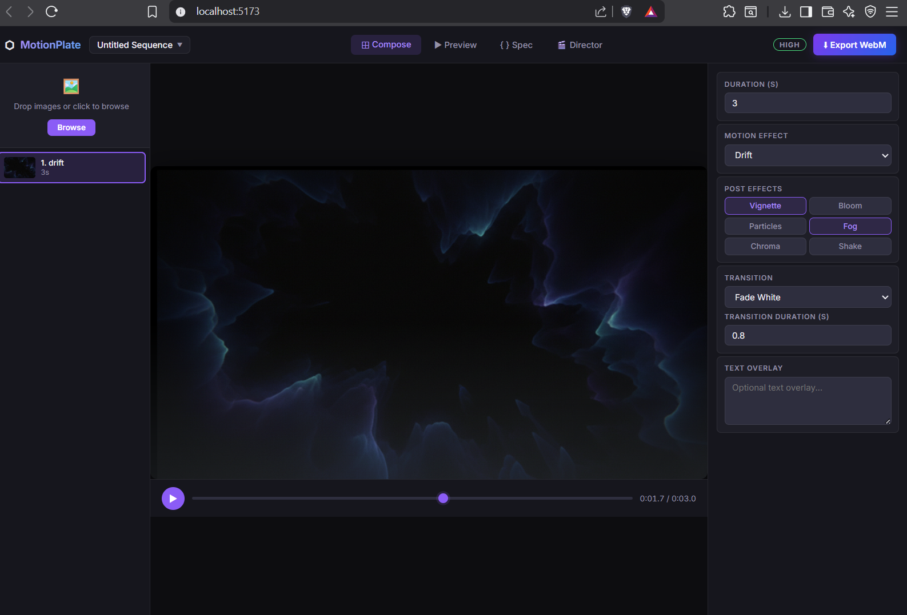

{
  "meta": {
    "title": "Untitled Sequence",
    "fps": 30,
    "width": 1280,
    "height": 720,
    "schemaVersion": "1.1.0"
  },
  "plates": [
    {
      "id": "plate_1",
      "duration": 3,
      "effect": "drift",
      "effectConfig": {
        "startScale": 1,
        "endScale": 1.15,
        "panX": 0.02,
        "panY": 0.01,
        "anchor": "center"
      },
      "post": [
        "vignette",
        "fog"
      ],
      "postConfig": {
        "vignette": {
          "intensity": 0.4
        }
      },
      "transition": "fadeThroughWhite",
      "transitionDuration": 0.8,
      "text": "",
      "textConfig": {
        "fontSize": 28,
        "fontFamily": "Georgia, serif",
        "color": "#ffffff",
        "position": "center",
        "fadeIn": 0.15,
        "fadeOut": 0.15,
        "maxWidth": 0.8,
        "shadow": true,
        "lineHeight": 1.5
      }
    }
  ]
}

E:\co\Doxascope\Vault\DOXASCOPE-Teaser\s1_1_void_001.webm

# Why the exportted video is only 1 second long?